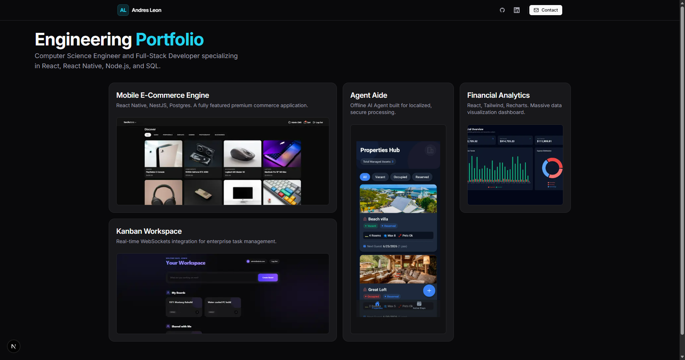

# ⚡️ Portfolio

  

 

A high-performance software engineering portfolio designed to showcase scalable SaaS applications, mobile e-commerce engines, and full-stack system architecture. Built with an extreme focus on SEO, zero-layout-shift UI/UX, data-driven conversion tracking, and rigorous code quality using the modern Next.js 15 App Router.

## 🚀 Live Deployment

- 🌐 **Production (Vercel):** [https://andres-portfolio-tau.vercel.app](https://andres-portfolio-tau.vercel.app)

---

## ✨ System Architecture & Features

This application serves as a living demonstration of production-ready frontend engineering, divided into structural, visual, analytical, and security architectures.

### 🍱 The Bento Box UI/UX & Motion Physics
* **Visual Hierarchy:** Implements a modern "Bento Box" asymmetrical grid architecture for optimal scannability, allocating premium screen real estate to complex, full-stack projects.
* **Apple-Tier Haptics:** Integrates Framer Motion for hardware-accelerated, buttery 60fps load-in staggers and hover transformations. 
* **Inversion of Control (IoC):** Uses a strict compositional pattern to isolate Framer Motion Client Components (`BentoGrid.tsx`) from the Next.js Server Components (`page.tsx`), ensuring maximum interactivity without sacrificing Server-Side Rendering (SSR) performance.

### 📊 Custom Telemetry & Analytics Pipeline
* **GA4 Integration:** Implements the `@next/third-parties/google` library for zero-blocking background telemetry.
* **Conversion Tracking:** Features a highly reusable `<TrackedLink>` wrapper component that intercepts user interactions to dispatch custom data layer events (e.g., `outbound_github_click`, `outbound_demo_click`) directly to Google Analytics before executing native routing.

### 🛡️ Enterprise Security & Engine (Next.js)
* **Edge Security Headers:** Configured via `vercel.json` to enforce strict HTTP security headers at the edge network layer, including `X-Frame-Options: DENY`, `X-Content-Type-Options: nosniff`, and `Strict-Transport-Security`.
* **Zero JS by Default:** Heavily leverages React Server Components (RSC) to ship static HTML to the client for the foundational layout, maximizing Lighthouse scores and time-to-interactive metrics.
* **Atomic CSS:** Tailwind CSS is used strictly to enforce design tokens, resulting in a microscopic CSS bundle and absolutely zero runtime styling overhead.

---

## ⚙️ Tech Stack & Dependencies

### Runtimes
- **Node.js:** `v20+`
- **npm:** `10+`

### Frontend (Web)
- **Framework:** Next.js (`v15+` App Router)
- **Language:** TypeScript
- **Styling:** Tailwind CSS (Atomic engine)
- **Icons:** Lucide React
- **Animations:** Framer Motion
- **Telemetry:** Google Analytics 4

---

## 🚀 How to Run Locally

### 1. Clone the repository
`git clone https://github.com/notrexxx/enterprise-portfolio.git`  
`cd enterprise-portfolio`

### 2. Install Dependencies
Ensure you have Node.js installed, then run:  
`npm install`

### 3. Start the Development Server
`npm run dev`  
*(Open http://localhost:3000 in your browser to view the application).*

## Author

👤 **Andres Leon**

- GitHub: [@notrexxx](https://github.com/notrexxx)
- LinkedIn: [Emigdio Leon](https://linkedin.com/emigdio-leon-689109195)